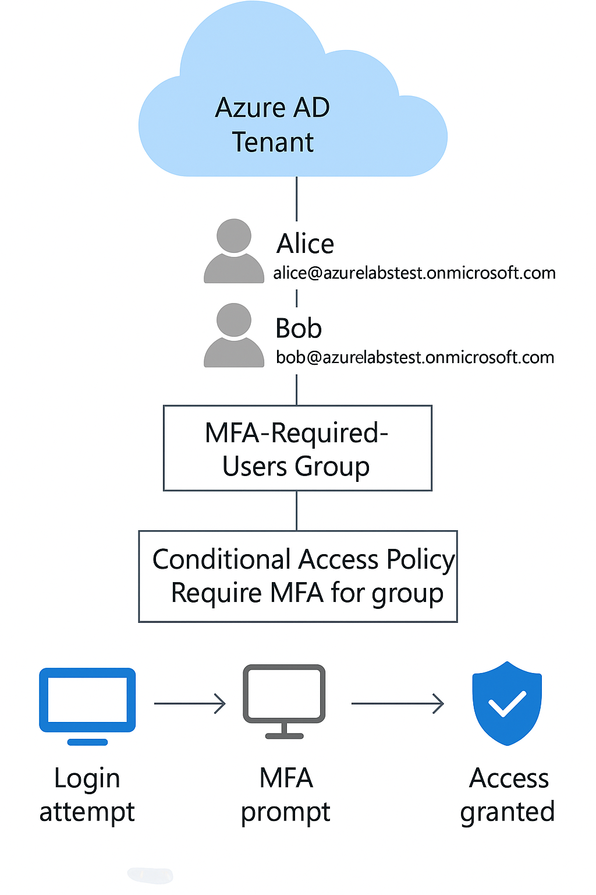

## Microsoft Entra ID Conditional Access & MFA Lab

Implementation of a secure Microsoft Entra ID environment by enforcing Multi-Factor Authentication (MFA) through Conditional Access policies for group-based identity protection. Demonstrates Zero Trust, risk reduction, and modern identity management in Azure.

---

## Table of Contents

- [Overview]
- [Real-World Risk]
- [What I Built]
- [Diagram]
- [Objectives]
- [Steps Performed]
  - [1. Microsoft Entra ID User Creation]
  - [2. Security Group Setup]
  - [3. Per-User MFA Enablement (Legacy)]
  - [4. Conditional Access Policy Configuration]
  - [5. MFA Prompt Verification]
  - [6. Cleanup]
- [Screenshots]
- [Lessons Learned]
- [References]

---

## Overview

This lab demonstrates how to protect cloud identities in Microsoft Azure using Conditional Access and Multi-Factor Authentication (MFA). The setup ensures only authorized users, from a specific group, can access cloud resources—and only after passing MFA. This reflects real-world security practice, following the Zero Trust model to defend against credential compromise.

---

## Real-World Risk

Most security breaches are caused by compromised user credentials. Attackers use phishing, credential stuffing, or brute force attacks to gain unauthorized access to cloud services. Without strong authentication and context-based access control, even a single leaked password can give an attacker access to sensitive data or critical infrastructure.
By using Conditional Access with Multi-Factor Authentication (MFA) in Azure, organizations drastically reduce the risk of unauthorized access—helping to prevent data breaches, account takeover, and privilege escalation.

---

## What I Built

- Microsoft Entra ID users (Alice and Bob) and a dedicated security group (MFA-Required-Users)
- A Conditional Access policy targeting the group, requiring MFA for all sign-ins to cloud apps.
- Enforced group-based identity protection following Zero Trust security principles.
- Full test flow: user login, MFA prompt enforced, access granted only after successful verification.
- Screenshots, documentation, and an architecture diagram for recruiter and technical review.

---

## Diagram

---

## Objectives

- Create Microsoft Entra ID users and assign them to security groups.
- Deploy a Conditional Access policy that enforces MFA for group members.
- Test and validate that only group members are prompted for MFA.
- Document each step for technical and recruiter review.

---

## Steps Performed

1. Microsoft Entra ID User Creation
   - Created two cloud-only users in Azure AD for lab testing: Alice (alice@azurelabstest.onmicrosoft.com) and Bob (bob@azurelabstest.onmicrosoft.com. Screenshot: users-list.png)

2. Security Group Setup
   - Created the security group MFA-Required-Users in Microsoft Entra ID.
   - Added Alice and Bob as members for targeted policy assignment (Screenshot: group-members.png)

3. Per-User MFA Enablement (Legacy)
   - Enabled per-user MFA for Alice and Bob using Microsoft Entra ID’s classic MFA settings (Screenshot: per-user-mfa-enabled.png)

4. Conditional Access Policy Configuration
   - Navigated to Microsoft Entra ID → Security → Conditional Access.
   - Created a Conditional Access policy named Require MFA for MFA-Required-Users.
     - Assigned the policy to the MFA-Required-Users group.
     - Targeted all cloud apps.
     - Set the access control to require multi-factor authentication.
     - Enabled the policy after disabling Security Defaults.
   - Verified policy status in the Conditional Access policies table (Screenshot: conditional-access-policy.png)

5. MFA Prompt Verification
   - Tested the policy by signing in as Alice Demo.
   - Verified that an MFA registration prompt was required before access was granted to cloud resources.
   - Confirmed the Conditional Access policy was actively enforcing MFA for group members (Screenshot: mfa-prompt.png)

6. Cleanup
   - Deleted test users (Alice and Bob) from Microsoft Entra ID to prevent unused accounts.
   - Removed the MFA-Required-Users security group.
   - Deleted the Conditional Access policy enforcing MFA.
   - Disabled per-user MFA settings for the lab users (if previously enabled).
   - Verified no lab-related objects remain in Microsoft Entra ID or Conditional Access policies.

---

## Screenshots

*All screenshots are included in the screenshots/ folder.

| Step | Filename                      | Description                                                   |
| ---- | ----------------------------- | ------------------------------------------------------------- |
| 1    | users-list.png                | Microsoft Entra ID user table with Alice and Bob created.     |
| 2    | group-members.png             | MFA-Required-Users group with Alice and Bob as members.       |
| 3    | conditional-access-policy.png | Conditional Access policy configured to require MFA for group.|
| 4    | per-user-mfa-enabled.png      | Per-user MFA enabled for Alice and Bob (legacy approach)      |
| 5    | mfa-prompt.png                | MFA prompt shown to Alice/Bob on sign-in (policy tested)      |

---

## Lessons Learned

- Conditional Access is the enterprise-ready way to enforce context-driven MFA in Azure—more flexible and secure than per-user MFA alone.
- Group-based policies allow for granular, scalable identity security.
- Documentation (screenshots, diagrams) is essential for proving security posture to technical and non-technical audiences.
- Microsoft Entra ID’s sign-in logs are powerful for verifying policy effectiveness and for audit trails.

---

## References

- Conditional Access in Microsoft Entra ID
(https://learn.microsoft.com/en-us/entra/identity/conditional-access/)

- Enable per-user MFA in Microsoft Entra ID
(https://learn.microsoft.com/en-us/entra/identity/authentication/tutorial-enable-azure-mfa)

- Zero Trust Security Principles: Microsoft Zero Trust Guidance
(https://www.microsoft.com/en-us/security/business/zero-trust)

---

Sebastian Silva C. – July, 2025 – Berlin, Germany.
